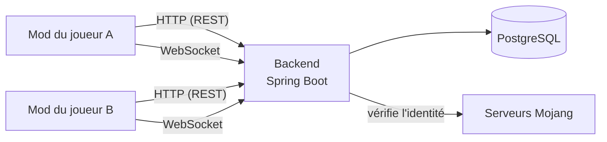
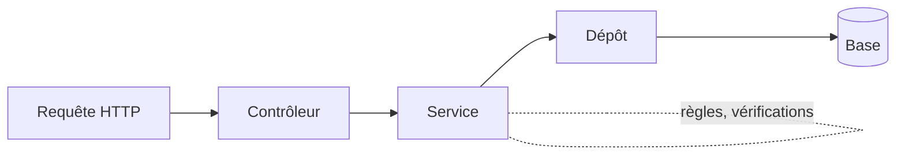

# 1. Vue d'ensemble

## 1.1 Le problème à résoudre

Phantasmon permet à des joueurs de Minecraft (avec le mod Cobblemon) de posséder des **Ghost Pokémon** : des
Pokémon créés librement, rangés dans un PC à part, qu'on peut faire apparaître dans le monde, échanger et faire
combattre. Contrainte forte du projet : **on n'installe rien sur le serveur Minecraft**. Seuls les joueurs
installent un mod.

Problème : si chaque joueur garde ses Pokémon chez lui, rien n'empêche de tricher (modifier ses fichiers, se créer
un Pokémon déjà échangé…), et deux joueurs ne peuvent pas se « voir » sans passer par un intermédiaire. Il faut donc
un **troisième programme**, indépendant de Minecraft, qui :

- garde les données de façon fiable (une base de données) ;
- vérifie l'identité de chaque joueur ;
- refuse les opérations interdites (modifier le Pokémon d'un autre, des statistiques illégales…) ;
- relaie en temps réel les événements entre joueurs (un Ghost qui sort, un échange, un combat).

Ce programme est le **backend**. C'est la **source de vérité** : en cas de désaccord entre un client et le
backend, le backend a raison.

## 1.2 Les pièces du système



| Pièce | Rôle | Technologie |
|---|---|---|
| Mod client | Interface du joueur, affichage, envoi des requêtes | Fabric (Java) — voir le parcours du dépôt Client |
| Backend | Règles, données, relais temps réel | Java 21 + Spring Boot 4.1 |
| Base de données | Stockage durable | PostgreSQL |
| Mojang | Prouve qu'un joueur possède bien son compte | Service externe |

Le client parle au backend de **deux façons** :

- **REST** (HTTP) pour les actions ponctuelles « je demande, tu réponds » : créer un Pokémon, lister son PC…
- **WebSocket** pour le temps réel : une connexion qui reste ouverte, où chacun peut envoyer un message à tout
  moment (le backend prévient B que A a sorti son Ghost, sans que B ait rien demandé).

## 1.3 Ce que le backend sait faire

| Domaine | Exemple |
|---|---|
| Authentification | Échanger une preuve Mojang contre un jeton d'accès (JWT) |
| Pokémon | Créer, lister, modifier, déplacer, cloner, supprimer ; refuser les statistiques illégales |
| Présence | Savoir qui est connecté, sur quel serveur Minecraft, dans quelle dimension, à quelle position |
| Ghost | Prévenir les joueurs proches qu'un Ghost apparaît, bouge, disparaît |
| Échanges | Négocier un échange entre deux joueurs, puis l'exécuter de façon atomique |
| Combats | Organiser un combat dont le calcul est fait par l'un des deux clients |

## 1.4 Lire le dépôt

```text
Phantasmon-Backend/
├── build.gradle, settings.gradle, gradlew   construction (chapitre 4)
├── docker-compose.yml, .env.template        environnement local (chapitre 13)
├── src/main/java/com/mystaria/phantasmon_backend/
│   ├── PhantasmonBackendApplication.java    point d'entrée (chapitre 5)
│   ├── auth/  player/  pokemon/  trade/  battle/  presence/  websocket/  version/  health/
│   └── logging/  common/  config/
├── src/main/resources/
│   ├── application.properties               configuration (chapitre 5)
│   └── db/migration/V1__…sql → V8__…sql     schéma de la base (chapitre 7)
└── src/test/java/…                          tests (chapitre 14)
```

Le code est rangé **par domaine métier** (`pokemon/`, `trade/`…) et non par couche technique (`controllers/`,
`services/`…). Avantage : tout ce qui concerne les échanges est dans `trade/` ; on comprend un domaine sans
parcourir tout le projet. Dans chaque domaine on retrouve les mêmes rôles :

| Rôle | Exemple | Responsabilité |
|---|---|---|
| Contrôleur | `PokemonController` | Reçoit la requête HTTP, appelle le service, renvoie la réponse |
| Service | `PokemonService` | Règles métier, transactions |
| Dépôt (repository) | `PokemonRepository` | Lire et écrire en base |
| Entité | `Pokemon` | Une ligne de table, en objet Java |
| DTO (records) | `PokemonCreateRequest`, `PokemonResponse` | La forme exacte du JSON reçu ou envoyé |



## 1.5 Le principe qui guide tout : ne jamais faire confiance au client

Un mod tourne sur la machine du joueur : il peut être modifié. Le backend part donc du principe que **toute
requête peut mentir**. Conséquences visibles partout dans le code :

- le joueur est identifié par son jeton (JWT), jamais par un champ du JSON ;
- avant de modifier un Pokémon, le backend relit en base à qui il appartient ;
- les statistiques sont revérifiées par le backend même si le client les a déjà vérifiées ;
- un échange revérifie tout au moment de s'exécuter, même si tout semblait correct une seconde avant.

## À retenir

- Le backend est un programme indépendant, source de vérité, qui protège les données et relaie le temps réel.
- REST pour « demander/répondre », WebSocket pour « être prévenu ».
- Le code est rangé par domaine ; chaque domaine suit le même découpage contrôleur / service / dépôt / entité / DTO.
- Ne jamais faire confiance au client.
