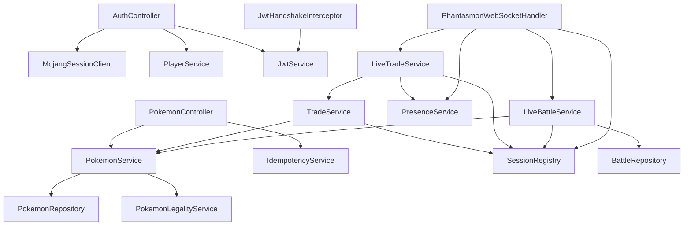

# 5. Les bases de Spring Boot

## 5.1 Le problème que résout Spring

Un backend a besoin d'un serveur HTTP, d'une connexion à la base, d'un convertisseur JSON, d'un système de sécurité…
et de services qui s'utilisent les uns les autres. Sans framework, il faudrait créer et relier tous ces objets à la
main, dans le bon ordre. **Spring** le fait pour nous. **Spring Boot** ajoute une configuration automatique : il
suffit d'ajouter une dépendance (par exemple le pilote PostgreSQL et Spring Data JPA) pour que la connexion à la
base soit configurée.

## 5.2 Le conteneur et les beans

Au démarrage, Spring crée un **conteneur** (le « contexte d'application ») qui fabrique et garde des objets appelés
**beans**. Une classe devient un bean quand elle porte une annotation de composant :

| Annotation | Usage |
|---|---|
| `@Component` | Bean générique (`JwtService`, `SessionRegistry`) |
| `@Service` | Bean qui contient de la logique métier (`PokemonService`) — même effet que `@Component`, nom plus parlant |
| `@RestController` | Bean qui répond aux requêtes HTTP |
| `@Configuration` + `@Bean` | Classe qui fabrique des beans « à la main » (`SecurityConfig`, `ClockConfig`) |

Par défaut, un bean est un **singleton** : une seule instance, partagée par toutes les requêtes. Conséquence : un
bean ne doit pas garder d'état propre à une requête dans ses champs. Ceux qui gardent un état partagé
(`PresenceService`) doivent gérer la concurrence (chapitre 2.11).

## 5.3 L'injection de dépendances

Un bean déclare ce dont il a besoin dans son **constructeur** ; Spring lui fournit les beans correspondants.

```java
// pokemon/PokemonService.java
@Service
public class PokemonService {
    private final PokemonRepository pokemonRepository;
    private final PokemonLegalityService legalityService;

    public PokemonService(PokemonRepository pokemonRepository, PokemonLegalityService legalityService) {
        this.pokemonRepository = pokemonRepository;
        this.legalityService = legalityService;
    }
}
```

`PokemonService` ne crée jamais son dépôt : il le **reçoit**. Avantages : les dépendances sont visibles d'un coup
d'œil, et en test on peut fournir une autre implémentation. Voici le graphe réel (simplifié) des services :



Règle d'architecture visible ici : les dépendances vont **dans un seul sens** (`trade` utilise `pokemon`, jamais
l'inverse). Quand `pokemon` a eu besoin de savoir si un Pokémon était dans un échange en attente, on a écrit une
requête SQL dans `PokemonRepository` plutôt que d'importer une classe de `trade`.

## 5.4 Le point d'entrée

```java
// PhantasmonBackendApplication.java
@SpringBootApplication     // active la configuration automatique et la recherche des beans dans ce paquet et ses sous-paquets
@EnableScheduling          // active les tâches @Scheduled (balayage TTL, rétention des logs)
public class PhantasmonBackendApplication {
    public static void main(String[] args) {
        SpringApplication.run(PhantasmonBackendApplication.class, args);
    }
}
```

`@SpringBootApplication` étant dans `com.mystaria.phantasmon_backend`, Spring trouve automatiquement toutes les
classes annotées des sous-paquets `auth`, `pokemon`, etc.

## 5.5 La configuration

`src/main/resources/application.properties` contient des paires clé = valeur. Une valeur peut lire une variable
d'environnement, avec une valeur par défaut :

```properties
spring.datasource.url=jdbc:postgresql://${BDD_HOST:localhost}:${BDD_PORT:5432}/${BDD_NAME:db_phantasmon}
spring.datasource.username=${BDD_USER}
phantasmon.jwt.secret=${JWT_SECRET}
phantasmon.jwt.access-ttl=PT20M
```

Les clés `spring.*` sont lues par Spring lui-même ; les clés `phantasmon.*` sont les nôtres, injectées avec
`@Value` :

```java
// auth/JwtService.java
public JwtService(@Value("${phantasmon.jwt.secret}") String secret,
                  @Value("${phantasmon.jwt.access-ttl}") Duration accessTtl, …) { … }
```

Spring convertit tout seul `PT20M` en `Duration`. Si `JWT_SECRET` n'existe nulle part, le démarrage échoue
immédiatement (`Could not resolve placeholder`) : c'est voulu, mieux vaut ne pas démarrer qu'un serveur sans secret.

Ordre de priorité (simplifié) : arguments de ligne de commande (`--server.port=8081`) > variables d'environnement >
`application.properties`.

## 5.6 Intervenir avant le démarrage : `EnvironmentPostProcessor`

Le projet lit un fichier `.env` en développement. Il faut le faire **avant** que Spring ne résolve les `${…}` : on
utilise un `EnvironmentPostProcessor`, une extension appelée très tôt.

```java
// config/DotenvEnvironmentPostProcessor.java (raccourci)
public class DotenvEnvironmentPostProcessor implements EnvironmentPostProcessor, Ordered {
    public int getOrder() { return HIGHEST_PRECEDENCE; }          // passer avant les autres

    public void postProcessEnvironment(ConfigurableEnvironment environment, SpringApplication application) {
        Path envFile = Path.of(".env");
        if (!Files.isRegularFile(envFile)) return;                // pas de .env : rien à faire (CI, production)
        Map<String, Object> values = …;                           // lit chaque ligne CLE=valeur
        environment.getPropertySources().addLast(new MapPropertySource("phantasmonDotenv", values));
    }
}
```

`addLast` donne au `.env` la **plus faible** priorité : une vraie variable d'environnement l'emporte toujours. Ces
classes ne sont pas des beans (le conteneur n'existe pas encore) : elles sont déclarées dans
`src/main/resources/META-INF/spring/org.springframework.boot.env.EnvironmentPostProcessor`.

## 5.7 Tâches planifiées

```java
// websocket/PresenceTtlSweeper.java
@Scheduled(fixedRateString = "${phantasmon.presence.sweep-interval-ms}")
public void sweep() { … }      // appelée toutes les 10 s par Spring
```

## 5.8 La séquence de démarrage

1. `main` → `SpringApplication.run`.
2. Les `EnvironmentPostProcessor` préparent la configuration (`.env`, fichier de log).
3. La journalisation démarre.
4. Le conteneur crée les beans dans l'ordre de leurs dépendances (connexion à la base, JPA, sécurité, contrôleurs…).
5. Flyway applique les migrations manquantes.
6. Le serveur web intégré (Tomcat) écoute sur le port 8080.
7. Les tâches `@Scheduled` démarrent.

## À retenir

- Spring crée et relie les objets (beans) ; on déclare ses dépendances dans le constructeur.
- Les beans sont des singletons partagés entre requêtes.
- La configuration vient de `application.properties`, surchargée par l'environnement ; `@Value` l'injecte.
- `EnvironmentPostProcessor` pour agir avant le démarrage, `@Scheduled` pour les tâches périodiques.
