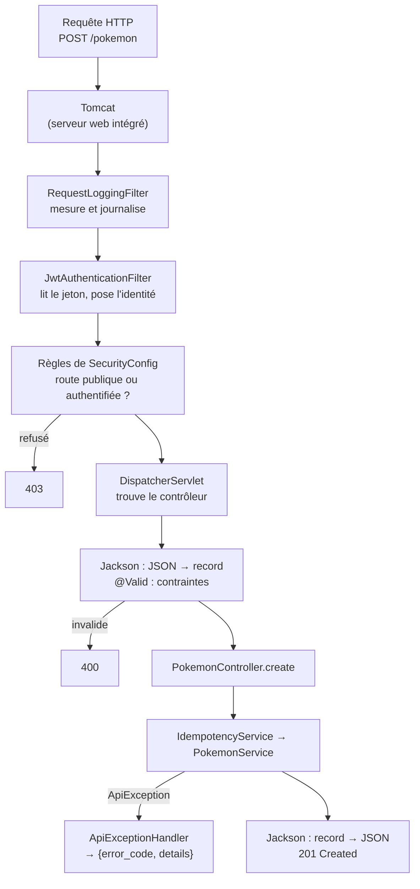

# 6. Le pipeline d'une requête REST

Ce chapitre suit une requête `POST /pokemon` depuis son arrivée jusqu'à la réponse.



## 6.1 Les filtres

Un **filtre** voit passer chaque requête avant (et après) le contrôleur. On l'utilise pour ce qui concerne toutes
les routes : journaliser, authentifier.

```java
// logging/RequestLoggingFilter.java
@Component
@Slf4j
public class RequestLoggingFilter extends OncePerRequestFilter {
    protected void doFilterInternal(HttpServletRequest request, HttpServletResponse response, FilterChain filterChain)
            throws ServletException, IOException {
        long start = System.currentTimeMillis();
        try {
            filterChain.doFilter(request, response);       // laisse passer la requête vers la suite
        } finally {
            log.info("{} {} -> {} ({} ms)", request.getMethod(), request.getRequestURI(),
                    response.getStatus(), System.currentTimeMillis() - start);
        }
    }
}
```

`filterChain.doFilter(...)` est l'appel clé : tout ce qui est avant s'exécute à l'aller, tout ce qui est après au
retour. Un filtre qui ne l'appelle pas bloque la requête.

## 6.2 La sécurité : qui peut appeler quoi

```java
// auth/SecurityConfig.java
@Configuration
@EnableWebSecurity
public class SecurityConfig {
    @Bean
    SecurityFilterChain filterChain(HttpSecurity http, JwtAuthenticationFilter jwtAuthenticationFilter) throws Exception {
        http
            .csrf(csrf -> csrf.disable())                                       // pas de cookies, pas de CSRF
            .sessionManagement(s -> s.sessionCreationPolicy(SessionCreationPolicy.STATELESS))  // pas de session serveur
            .authorizeHttpRequests(auth -> auth
                .requestMatchers(HttpMethod.GET, "/health", "/version").permitAll()
                .requestMatchers(HttpMethod.POST, "/auth/session", "/auth/refresh").permitAll()
                .requestMatchers("/ws").permitAll()                             // le WebSocket a sa propre vérification
                .anyRequest().authenticated())                                  // tout le reste exige une identité
            .addFilterBefore(jwtAuthenticationFilter, UsernamePasswordAuthenticationFilter.class);
        return http.build();
    }
}
```

Le `JwtAuthenticationFilter` (détaillé au chapitre 8) lit l'en-tête `Authorization: Bearer …`. Si le jeton est
valide, il enregistre l'identité du joueur (son UUID) dans le **contexte de sécurité** de la requête. Sinon il ne
fait rien, et la règle `authenticated()` refuse la requête.

## 6.3 Le contrôleur

```java
// pokemon/PokemonController.java
@RestController
public class PokemonController {
    …
    @PostMapping("/pokemon")
    public ResponseEntity<PokemonResponse> create(@Valid @RequestBody PokemonCreateRequest request,
                                                  Authentication authentication) {
        UUID ownerUuid = playerUuid(authentication);                       // l'identité vient du jeton
        PokemonResponse response = idempotencyService.executeIdempotent(
                request.requestUuid(), ownerUuid, "POST /pokemon",
                () -> pokemonService.create(ownerUuid, request), PokemonResponse.class);
        return ResponseEntity.status(HttpStatus.CREATED).body(response);
    }

    @GetMapping("/players/{uuid}/pc")
    public List<PokemonResponse> pcBox(@PathVariable UUID uuid, @RequestParam int box, Authentication authentication) {
        requireSelf(uuid, authentication);                                 // on ne lit que son propre PC
        return pokemonService.pcBox(uuid, box);
    }

    private static UUID playerUuid(Authentication authentication) {
        return (UUID) authentication.getPrincipal();
    }
}
```

| Élément | Rôle |
|---|---|
| `@PostMapping("/pokemon")` | Associe la méthode à `POST /pokemon` |
| `@RequestBody` | Le corps JSON est converti en `PokemonCreateRequest` |
| `@Valid` | Les contraintes du record sont vérifiées avant d'entrer dans la méthode |
| `@PathVariable` | Lit `{uuid}` dans le chemin, converti en `UUID` |
| `@RequestParam` | Lit `?box=3` |
| `Authentication` | Injecté par Spring Security : l'identité posée par le filtre |
| `ResponseEntity` | Permet de choisir le statut (201) ; sinon c'est 200 |

Le contrôleur reste **mince** : il traduit HTTP ↔ Java et délègue au service. Aucune règle métier n'y vit.

## 6.4 Le DTO et la validation

```java
// pokemon/PokemonCreateRequest.java
public record PokemonCreateRequest(
        @NotNull UUID requestUuid,
        @NotBlank String species,
        String form,
        @NotNull @Min(1) @Max(100) Integer level,
        @NotBlank String nature,
        @NotBlank String ability,
        Boolean isShiny,
        @Min(1) @Max(16) Integer boxId,
        @Min(1) @Max(30) Integer boxSlot,
        @Min(1) @Max(6) Integer teamSlot,
        @NotBlank String cobblemonDataVersion,
        @NotNull Map<String, Object> data) {
}
```

- Le record **est** le contrat : `request_uuid` dans le JSON devient `requestUuid` grâce à la stratégie snake_case.
- `Integer` / `Boolean` (et non `int` / `boolean`) permettent la valeur `null` = « champ absent ».
- Champ volontairement **absent** : `owner_uuid`. Le propriétaire ne peut pas venir du client.
- La validation par annotations vérifie la **forme**. Les règles métier (légalité des IV/EV, place libre…) sont
  dans le service, appelées explicitement. Une requête qui viole une annotation reçoit un 400 au format par
  défaut de Spring (pas de `error_code` : dette connue DEBT-2).

## 6.5 Les erreurs métier

Un service lève `ApiException` ; un seul composant la convertit pour **tous** les contrôleurs :

```java
// common/ApiExceptionHandler.java
@RestControllerAdvice
public class ApiExceptionHandler {
    @ExceptionHandler(ApiException.class)
    public ResponseEntity<ErrorResponse> handleApiException(ApiException ex) {
        return ResponseEntity.status(ex.getStatus()).body(new ErrorResponse(ex.getErrorCode(), ex.getDetails()));
    }
}
```

`@RestControllerAdvice` = « s'applique à tous les contrôleurs ». Le service n'a donc qu'à écrire :

```java
throw new ApiException(HttpStatus.FORBIDDEN, "ERROR_OWNERSHIP_MISMATCH", Map.of("uuid", pokemonUuid));
```

## 6.6 Le cas le plus simple : `GET /health`

```java
// health/HealthController.java
@RestController
public class HealthController {
    private final JdbcTemplate jdbcTemplate;               // accès SQL brut fourni par Spring
    …
    @GetMapping("/health")
    public ResponseEntity<Map<String, String>> health() {
        try {
            jdbcTemplate.queryForObject("SELECT 1", Integer.class);   // la base répond-elle vraiment ?
            return ResponseEntity.ok(Map.of("status", "UP", "database", "UP"));
        } catch (DataAccessException ex) {
            return ResponseEntity.status(HttpStatus.SERVICE_UNAVAILABLE).body(Map.of("status", "DOWN", "database", "DOWN"));
        }
    }
}
```

Une sonde de santé utile **teste réellement** ses dépendances au lieu de répondre « pong » : le client l'utilise
pour décider s'il tente de se connecter.

## À retenir

- Filtres (journalisation, jeton) → règles de sécurité → contrôleur → service → réponse.
- Le contrôleur traduit HTTP ↔ Java ; le service applique les règles ; l'identité vient toujours du jeton.
- Les records + annotations de validation définissent la forme du JSON accepté.
- Une exception métier unique, convertie en JSON à un seul endroit.
