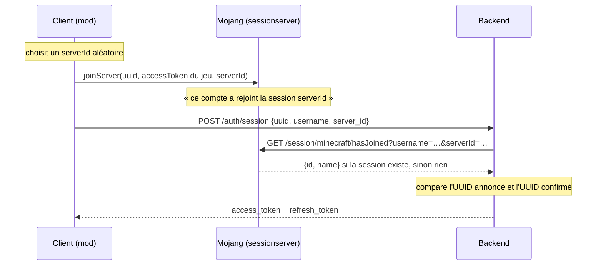

# 8. Sécurité et authentification

## 8.1 Deux questions différentes

- **Authentification** : *qui es-tu ?* Le backend doit être sûr que la requête vient bien du joueur `MystAria_`.
- **Autorisation** : *as-tu le droit ?* Ce joueur peut-il modifier **ce** Pokémon ?

Une erreur d'authentification donne un `401`, une erreur d'autorisation un `403`.

## 8.2 Prouver son identité sans mot de passe : la session Mojang

Le backend ne gère aucun mot de passe. Il réutilise le mécanisme qu'un **vrai serveur Minecraft** utilise pour
vérifier qu'un joueur possède bien son compte :



Pourquoi c'est sûr : seul le possesseur du compte détient l'**access token Minecraft** nécessaire à `joinServer`.
Ce jeton ne quitte jamais la machine du joueur : le backend ne reçoit que le `serverId`, et c'est Mojang qui
confirme. Un compte hors-ligne (« cracké ») n'a pas de session Mojang : il ne peut pas se connecter.

```java
// auth/MojangSessionClient.java (raccourci)
public Optional<MojangProfile> hasJoined(String username, String serverId, String clientIp) {
    try {
        MojangProfile profile = restClient.get()
                .uri(b -> b.path("/session/minecraft/hasJoined")
                           .queryParam("username", username).queryParam("serverId", serverId)…build())
                .retrieve()
                .body(MojangProfile.class);        // JSON → record
        return Optional.ofNullable(profile);
    } catch (RestClientException ex) {
        return Optional.empty();                   // Mojang a dit non, ou est injoignable
    }
}
```

`RestClient` est le client HTTP de Spring : le backend est ici **client** d'un autre serveur.

Puis, dans `AuthController.authenticate` : refus si Mojang ne confirme pas (`ERROR_AUTH_MOJANG_VERIFICATION_FAILED`),
refus si l'UUID annoncé n'est pas celui confirmé (`ERROR_AUTH_UUID_MISMATCH`), sinon création ou mise à jour du
joueur, puis émission des jetons.

## 8.3 Les jetons JWT

Vérifier Mojang à chaque requête serait lent. Après la preuve, le backend délivre son **propre jeton**, un JWT
(JSON Web Token), que le client joint à chaque requête.

Un JWT est une chaîne en trois parties séparées par des points : `en-tête.contenu.signature`.

```text
eyJhbGciOiJIUzI1NiJ9 . eyJzdWIiOiJiMWE0…IiwidHlwZSI6ImFjY2VzcyIsImV4cCI6…fQ . kX9r…
   {"alg":"HS256"}       {"sub":"<uuid>","type":"access","username":"Bichou",     signature HMAC
                          "iat":…,"exp":…}
```

- Le **contenu** (les *claims*) est lisible par n'importe qui (simple Base64) : on n'y met rien de secret.
- La **signature** est calculée avec une clé secrète (`JWT_SECRET`) connue du seul backend (algorithme
  HMAC-SHA256). Modifier un seul caractère du contenu rend la signature invalide. Le backend n'a donc **rien à
  stocker** : il lui suffit de vérifier la signature et la date d'expiration.

```java
// auth/JwtService.java (raccourci)
private String buildToken(UUID playerUuid, String type, Duration ttl, UnaryOperator<JwtBuilder> customizer) {
    Instant now = Instant.now();
    var builder = Jwts.builder()
            .subject(playerUuid.toString())        // « sub » : à qui appartient le jeton
            .claim("type", type)                   // "access" ou "refresh"
            .issuedAt(Date.from(now))
            .expiration(Date.from(now.plus(ttl)));
    return customizer.apply(builder).signWith(key).compact();
}

private Optional<Claims> parseToken(String token, String expectedType) {
    try {
        Claims claims = Jwts.parser().verifyWith(key).build().parseSignedClaims(token).getPayload();  // vérifie signature + expiration
        if (!expectedType.equals(claims.get("type", String.class))) return Optional.empty();
        return Optional.of(claims);
    } catch (JwtException | IllegalArgumentException ex) {
        return Optional.empty();
    }
}
```

### Deux jetons

| Jeton | Durée | Usage |
|---|---|---|
| Access token | 20 min | Joint à chaque requête (`Authorization: Bearer …`) et à l'ouverture du WebSocket |
| Refresh token | 7 jours | Uniquement pour `POST /auth/refresh`, qui renvoie un nouveau couple |

Un jeton volé ne sert que peu de temps ; le refresh token évite de redemander Mojang toutes les 20 minutes. Le
champ `type` empêche d'utiliser un refresh token comme access token et inversement.

Limite assumée : un JWT ne peut pas être « révoqué » avant son expiration sans stockage côté serveur. Le projet
n'en a pas encore (DEBT-3).

## 8.4 Brancher le jeton dans Spring Security

```java
// auth/JwtAuthenticationFilter.java
protected void doFilterInternal(HttpServletRequest request, HttpServletResponse response, FilterChain filterChain) … {
    String header = request.getHeader(HttpHeaders.AUTHORIZATION);
    if (header != null && header.startsWith("Bearer ")) {
        jwtService.parseAccessToken(header.substring(7)).ifPresent(claims -> {
            UUID playerUuid = UUID.fromString(claims.getSubject());
            var authentication = new UsernamePasswordAuthenticationToken(
                    playerUuid, null, List.of(new SimpleGrantedAuthority("ROLE_PLAYER")));
            SecurityContextHolder.getContext().setAuthentication(authentication);   // « cette requête vient de playerUuid »
        });
    }
    filterChain.doFilter(request, response);
}
```

Le filtre ne refuse jamais lui-même : il pose une identité ou rien. C'est la configuration
(`anyRequest().authenticated()`, chapitre 6) qui décide. Dans le contrôleur, `authentication.getPrincipal()` rend
l'UUID posé ici.

Pour le WebSocket, le navigateur/client ne peut pas toujours envoyer d'en-tête : le jeton passe dans l'URL
(`/ws?token=…`) et est vérifié par `JwtHandshakeInterceptor` (chapitre 10).

## 8.5 L'autorisation : vérifier la propriété à chaque fois

Être authentifié ne donne pas tous les droits. Chaque opération sur une ressource revérifie en base :

```java
// pokemon/PokemonService.java
private Pokemon findOwned(UUID ownerUuid, UUID pokemonUuid) {
    Pokemon pokemon = pokemonRepository.findById(pokemonUuid)
            .orElseThrow(() -> new ApiException(HttpStatus.NOT_FOUND, "ERROR_POKEMON_NOT_FOUND", …));
    if (!pokemon.getOwnerUuid().equals(ownerUuid)) {
        throw new ApiException(HttpStatus.FORBIDDEN, "ERROR_OWNERSHIP_MISMATCH", …);
    }
    return pokemon;
}
```

Même logique dans les échanges (seul le destinataire accepte), les combats (seul l'hôte envoie les paquets), les
Ghost (on ne fait sortir que son propre Pokémon de son équipe).

## 8.6 Les secrets

- `JWT_SECRET` et `BDD_PASSWORD` ne sont **jamais** commités : ils sont dans `.env` (ignoré par git) ou dans les
  variables d'environnement du serveur. `.env.template` montre les clés sans valeurs.
- Un secret par environnement : celui du développement ne sert jamais en production.
- Rien de secret dans les logs.

## 8.7 Ce qui reste à faire pour une vraie mise en production

- **HTTPS / WSS** : aujourd'hui le trafic circule en clair (HTTP/WS). Sur Internet, les jetons pourraient être
  interceptés. Un proxy inverse avec certificat (TLS) chiffrerait tout.
- Limitation du nombre de requêtes par joueur (prévue par le cahier des charges, non faite).
- Révocation des refresh tokens.

## À retenir

- Authentification sans mot de passe : la preuve Mojang `joinServer` / `hasJoined`.
- JWT = contenu lisible + signature secrète ; le serveur vérifie sans rien stocker ; access court, refresh long.
- Le filtre pose l'identité, la configuration décide, le service vérifie la propriété à chaque opération.
- Secrets hors du dépôt ; HTTPS indispensable avant une exposition publique.
