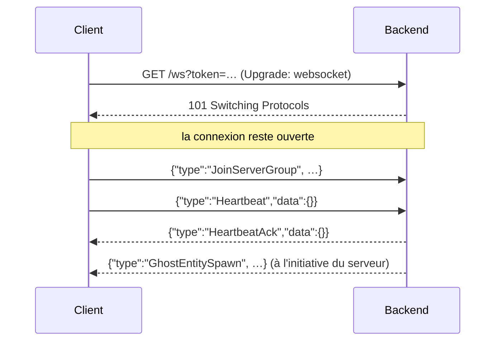

# 10. WebSocket et présence

## 10.1 Pourquoi HTTP ne suffit pas

Avec HTTP, c'est toujours le client qui parle en premier. Pour que B apprenne que A vient de sortir son Ghost, B
devrait demander « quoi de neuf ? » en boucle (*polling*) : lent et coûteux. Un **WebSocket** est une connexion qui
**reste ouverte** ; chacun des deux côtés peut envoyer un message quand il veut.



La connexion commence comme une requête HTTP normale (le **handshake**), puis « change de protocole ». Sur ce
canal, le projet échange des messages texte JSON avec une **enveloppe** commune :

```java
// websocket/WsMessage.java
public record WsMessage(String type, Map<String, Object> data) { … }
```

Le `type` dit quoi faire, `data` porte les paramètres. Un seul canal transporte la présence, les Ghost, les
échanges et les combats.

## 10.2 Configurer le point d'entrée

```java
// websocket/WebSocketConfig.java
@Configuration
@EnableWebSocket
public class WebSocketConfig implements WebSocketConfigurer {
    public void registerWebSocketHandlers(WebSocketHandlerRegistry registry) {
        registry.addHandler(handler, "/ws")
                .addInterceptors(jwtHandshakeInterceptor)   // vérifie le jeton AVANT d'ouvrir la connexion
                .setAllowedOrigins("*");
    }
}
```

```java
// websocket/JwtHandshakeInterceptor.java (raccourci)
public boolean beforeHandshake(ServerHttpRequest request, ServerHttpResponse response,
                               WebSocketHandler wsHandler, Map<String, Object> attributes) {
    String token = …getQueryParams().getFirst("token");
    return jwtService.parseAccessToken(token)
            .map(claims -> { attributes.put("playerUuid", UUID.fromString(claims.getSubject())); return true; })
            .orElseGet(() -> { response.setStatusCode(HttpStatus.UNAUTHORIZED); return false; });
}
```

Les `attributes` restent attachés à la session pendant toute sa vie : chaque message reçu ensuite sait de quel
joueur il vient, sans renvoyer le jeton.

## 10.3 Le gestionnaire : un aiguillage

`PhantasmonWebSocketHandler` hérite de `TextWebSocketHandler` et réagit à trois événements :

| Méthode | Quand |
|---|---|
| `afterConnectionEstablished` | Connexion ouverte : on agrandit la taille maximale des messages (1 Mio) et on enregistre la session |
| `handleTextMessage` | Un message arrive : on lit le JSON et on aiguille selon `type` |
| `afterConnectionClosed` | Connexion fermée (proprement ou non) : on nettoie tout ce qui concerne ce joueur |

```java
protected void handleTextMessage(WebSocketSession session, TextMessage message) throws Exception {
    UUID playerUuid = playerUuid(session);                     // posé par l'intercepteur
    WsMessage incoming;
    try {
        incoming = objectMapper.treeToValue(objectMapper.readTree(message.getPayload()), WsMessage.class);
    } catch (Exception ex) {
        send(session, WsMessage.error("ERROR_WS_MALFORMED_MESSAGE", Map.of()));
        return;
    }
    switch (incoming.type()) {
        case "JoinServerGroup" -> { presenceService.join(…); sendGhostCatchUp(session, playerUuid); }
        case "PositionUpdate" -> { presenceService.updatePosition(…); /* + GhostEntityMove si Ghost sorti */ }
        case "SendOutGhost" -> handleSendOutGhost(session, playerUuid, uuidField(incoming, "pokemon_uuid"));
        case "TradeInvite" -> liveTradeService.invite(playerUuid, uuidField(incoming, "target_uuid"));
        case "BattlePacket" -> liveBattleService.relayPacket(playerUuid, …);
        case "Heartbeat" -> { presenceService.heartbeat(playerUuid); send(session, WsMessage.of("HeartbeatAck", Map.of())); }
        …
        default -> send(session, WsMessage.error("ERROR_WS_UNKNOWN_MESSAGE_TYPE", Map.of("type", incoming.type())));
    }
}
```

Le gestionnaire ne contient presque pas de logique : il **route** vers les services, comme un contrôleur REST.

## 10.4 Savoir à qui écrire : `SessionRegistry`

```java
// websocket/SessionRegistry.java (raccourci)
private final Map<UUID, WebSocketSession> sessions = new ConcurrentHashMap<>();

public void send(UUID playerUuid, WsMessage message) {
    WebSocketSession session = sessions.get(playerUuid);
    if (session == null || !session.isOpen()) return;          // joueur déconnecté : on ignore
    sendTo(session, objectMapper.writeValueAsString(message));
}

public static void sendTo(WebSocketSession session, String payload) throws IOException {
    synchronized (session) {                                   // un seul thread écrit à la fois sur une session
        session.sendMessage(new TextMessage(payload));
    }
}
```

Le `synchronized` n'est pas décoratif : quand deux joueurs agissent en même temps dans un échange, deux threads
écrivent vers la même session ; sans verrou, le serveur web lève `TEXT_PARTIAL_WRITING` (chapitre 15).

## 10.5 La présence

La présence répond à « qui est connecté, où ? ». Elle vit **en mémoire** (pas en base) : c'est un état éphémère qui
n'a plus de sens après un redémarrage.

```java
// presence/PlayerPresence.java
public record PlayerPresence(UUID playerUuid, String serverFingerprint, String dimension,
                             Position position, Instant lastHeartbeatAt, UUID activeGhostPokemonUuid) { }
```

```java
// presence/PresenceService.java (raccourci)
private final Map<UUID, PlayerPresence> presences = new ConcurrentHashMap<>();

public void heartbeat(UUID playerUuid) {
    presences.computeIfPresent(playerUuid, (uuid, p) -> new PlayerPresence(
            p.playerUuid(), p.serverFingerprint(), p.dimension(), p.position(), clock.instant(), p.activeGhostPokemonUuid()));
}

/** Les AUTRES joueurs de même empreinte et même dimension. */
public List<UUID> groupMembers(UUID playerUuid) { … }
```

- Le **groupe** = même `server_fingerprint` (empreinte du serveur Minecraft, calculée par le client) **et** même
  dimension. Les événements Ghost ne sont envoyés qu'au groupe : deux joueurs sur des serveurs différents ne se
  voient pas.
- `PlayerPresence` est un record immuable : chaque mise à jour **remplace** l'objet (`computeIfPresent`), de façon
  atomique dans la `ConcurrentHashMap`. Aucun thread ne voit jamais une présence à moitié modifiée.
- `computeIfPresent` ne fait rien si le joueur n'a pas encore rejoint de groupe. C'est ce comportement qui rendait
  un bug client totalement silencieux (chapitre 15).

## 10.6 Les Ghost

```java
private void handleSendOutGhost(WebSocketSession session, UUID playerUuid, UUID pokemonUuid) throws Exception {
    Pokemon pokemon = pokemonRepository.findById(pokemonUuid).orElse(null);
    if (pokemon == null) { send(session, WsMessage.error("ERROR_POKEMON_NOT_FOUND", …)); return; }
    if (!pokemon.getOwnerUuid().equals(playerUuid)) { send(session, WsMessage.error("ERROR_OWNERSHIP_MISMATCH", …)); return; }
    if (pokemon.getTeamSlot() == null) { send(session, WsMessage.error("ERROR_POKEMON_NOT_IN_TEAM", …)); return; }
    presenceService.sendOutGhost(playerUuid, pokemonUuid);
    broadcastToGroupAndSelf(playerUuid, WsMessage.of("GhostEntitySpawn", ghostSpawnData(playerUuid, pokemon, position)));
}
```

- Toujours revérifier en base (le client peut mentir).
- Le message embarque l'espèce, la forme, le chromatique, le niveau et le sexe : le client destinataire n'a **aucun
  autre moyen** de connaître le Pokémon d'un autre joueur (les routes REST sont limitées à ses propres Pokémon).
- `broadcastToGroupAndSelf` : le groupe **et** le propriétaire, car `groupMembers` exclut l'appelant.
- Pas de message « le Ghost bouge » : chaque `PositionUpdate` du propriétaire déclenche un `GhostEntityMove`.
- **Rattrapage** : à l'arrivée dans un groupe, le serveur envoie au nouveau venu un `GhostEntitySpawn` pour chaque
  Ghost déjà sorti, sinon il ne les verrait qu'au prochain mouvement.

## 10.7 Détecter les clients disparus : heartbeat et TTL

Un jeu qui plante ne ferme pas proprement sa connexion. Le client envoie donc un `Heartbeat` chaque seconde ; une
tâche planifiée retire les présences silencieuses depuis plus de 30 s et ferme leur session :

```java
// websocket/PresenceTtlSweeper.java
@Scheduled(fixedRateString = "${phantasmon.presence.sweep-interval-ms}")
public void sweep() {
    for (UUID playerUuid : presenceService.findExpired()) {
        webSocketHandler.expire(playerUuid);        // quitte le groupe (despawn du Ghost), puis ferme la session
    }
}
```

Le temps est lu via un `Clock` injecté : en test, on avance l'horloge à la main au lieu d'attendre 30 s.

Piège d'ordre, déjà rencontré : l'ancienne version (`cleanupExpired`) retirait la présence **avant** que la
fermeture déclenche le nettoyage qui diffuse la disparition du Ghost ; ce nettoyage ne trouvait plus rien (BUG-4,
chapitre 15). `findExpired` ne retire plus rien : le départ passe par le même chemin qu'un `LeaveServerGroup`.

## 10.8 La fermeture

```java
public void afterConnectionClosed(WebSocketSession session, CloseStatus status) {
    UUID playerUuid = playerUuid(session);
    leaveAndDespawnGhost(playerUuid);           // présence retirée, Ghost retiré chez le groupe
    liveTradeService.onDisconnect(playerUuid);  // échange en cours annulé
    liveBattleService.onDisconnect(playerUuid); // combat en cours terminé sans vainqueur
    sessionRegistry.unregister(playerUuid);
}
```

`leaveAndDespawnGhost` calcule le groupe **avant** de retirer la présence : une fois retirée, on ne saurait plus à
qui annoncer la disparition.

## À retenir

- WebSocket = connexion ouverte bidirectionnelle ; handshake authentifié par le jeton dans l'URL.
- Une enveloppe `{type, data}`, un gestionnaire qui aiguille vers les services.
- Écrire sur une session depuis plusieurs threads exige un verrou.
- Présence en mémoire, groupée par empreinte de serveur et dimension ; heartbeat + TTL pour les clients disparus.
- L'ordre des opérations compte : calculer le groupe avant de retirer la présence.
