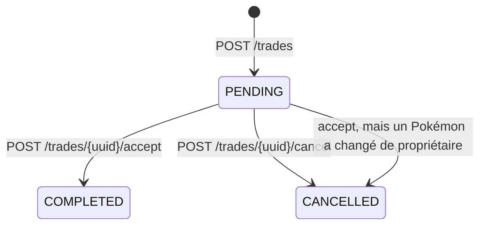
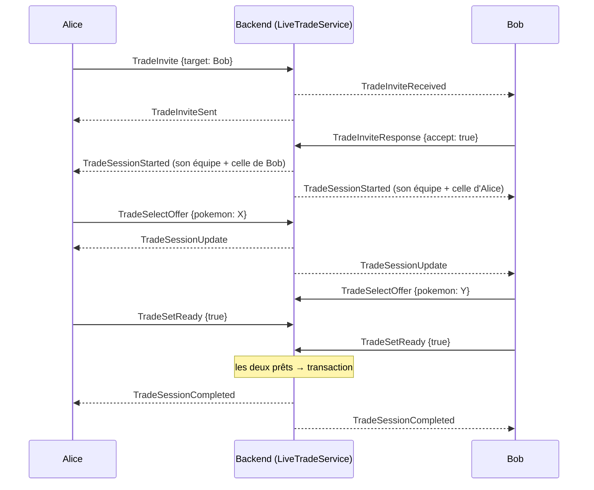

# 11. Les échanges

Deux façons d'échanger coexistent ; elles illustrent deux styles de conception.

| | Échange asynchrone | Échange en direct |
|---|---|---|
| Canal | REST | WebSocket |
| État pendant la négociation | Ligne `trades` en base (`PENDING`) | Objet en mémoire (`LiveTradeSession`) |
| Durée | Indéfinie (accepter des jours plus tard) | Quelques secondes à minutes, les deux joueurs connectés |
| Fichiers | `trade/TradeController`, `TradeService` | `trade/LiveTradeService`, `LiveTradeSession` |

## 11.1 L'échange asynchrone : un état en base



L'acceptation montre comment écrire une opération **atomique** :

```java
// trade/TradeService.java (raccourci)
@Transactional(noRollbackFor = ApiException.class)
public TradeResponse accept(UUID callerUuid, UUID tradeUuid) {
    Trade trade = findTrade(tradeUuid);
    if (!trade.getRecipientUuid().equals(callerUuid)) throw new ApiException(FORBIDDEN, "ERROR_OWNERSHIP_MISMATCH", …);
    requirePending(trade);
    Pokemon offered = findPokemon(trade.getOfferedPokemon());
    Pokemon requested = findPokemon(trade.getRequestedPokemon());
    if (!offered.getOwnerUuid().equals(trade.getInitiatorUuid()) || !requested.getOwnerUuid().equals(trade.getRecipientUuid())) {
        trade.setStatus(TradeStatus.CANCELLED);           // la situation a changé depuis la proposition
        tradeRepository.save(trade);
        throw new ApiException(CONFLICT, "ERROR_TRADE_OWNERSHIP_CHANGED", …);
    }
    pokemonService.transferOwnership(offered.getUuid(), trade.getRecipientUuid());
    pokemonService.transferOwnership(requested.getUuid(), trade.getInitiatorUuid());
    trade.setStatus(TradeStatus.COMPLETED);
    tradeRepository.save(trade);
    sessionRegistry.send(trade.getInitiatorUuid(), WsMessage.of("TradeAccepted", …));   // prévenir en temps réel
    …
}
```

Trois idées :

1. **Revérifier au moment d'agir** : entre la proposition et l'acceptation, un Pokémon a pu être échangé ailleurs.
2. **Tout ou rien** : les deux transferts sont dans la même transaction ; `transferOwnership` (annoté
   `@Transactional`) rejoint la transaction en cours.
3. **`noRollbackFor`** : normalement, lever une exception annule tout, y compris le passage à `CANCELLED` qu'on veut
   garder. `noRollbackFor = ApiException.class` force la validation. Revers de la médaille : un « PC plein » levé
   **dans** `transferOwnership` (méthode `@Transactional` appelée) marque déjà la transaction « rollback-only » ;
   au commit, Spring lève `UnexpectedRollbackException` et le joueur recevait une erreur 500 (BUG-5, chapitre 15).
   D'où `requirePcRoom` : la place est vérifiée des deux côtés **avant** tout transfert. Leçon : une exception à la
   règle du rollback doit être aussi étroite que possible, et ne vaut que pour les exceptions levées par la méthode
   elle-même.

REST et WebSocket se combinent : la requête REST modifie la base, puis `SessionRegistry` prévient les joueurs
connectés (`TradeProposed`, `TradeAccepted`, `TradeCancelled`).

## 11.2 L'échange en direct : une machine à états en mémoire



L'état de la négociation (qui offre quoi, qui est prêt) n'a de valeur que tant que les deux joueurs sont là ; on ne
l'écrit donc pas en base. Seul le résultat final l'est.

```java
// trade/LiveTradeService.java (raccourci)
@Service
public class LiveTradeService {
    private final Map<UUID, LiveTradeSession> sessionsByPlayer = new HashMap<>();   // joueur → sa session
    private final Map<UUID, LiveTradeInvite> invites = new HashMap<>();

    public synchronized void selectOffer(UUID playerUuid, UUID pokemonUuid) {
        LiveTradeSession session = sessionsByPlayer.get(playerUuid);
        if (session == null) { sendError(playerUuid, "ERROR_TRADE_NOT_IN_SESSION"); return; }
        Pokemon pokemon = pokemonRepository.findById(pokemonUuid).orElse(null);   // revérifier en base
        … // existe ? appartient au joueur ? dans son équipe ?
        session.setOffer(playerUuid, pokemonUuid);   // remet aussi « prêt » à faux pour les deux
        broadcastUpdate(session);
    }

    public synchronized void setReady(UUID playerUuid, boolean ready) {
        …
        session.setReady(playerUuid, ready);
        broadcastUpdate(session);
        if (session.bothReady()) complete(session);
    }
}
```

### Concurrence : un seul verrou

Les deux joueurs envoient leurs messages sur **deux threads différents**. Sans protection, Alice et Bob cliquant
« prêt » au même instant pourraient déclencher deux exécutions. Toutes les méthodes publiques sont `synchronized`
(un seul verrou pour tout le service) : simple et suffisant, car il n'y a jamais que quelques échanges à la fois.
Les `HashMap` ordinaires suffisent donc, puisqu'elles ne sont touchées que sous ce verrou.

### Chaque joueur reçoit son propre point de vue

```java
private void sendUpdate(LiveTradeSession session, UUID playerUuid) {
    UUID partnerUuid = session.partnerOf(playerUuid);
    Map<String, Object> data = new HashMap<>();
    data.put("own_offer", session.offerOf(playerUuid));
    data.put("partner_offer", session.offerOf(partnerUuid));
    data.put("own_ready", session.isReady(playerUuid));
    data.put("partner_ready", session.isReady(partnerUuid));
    sessionRegistry.send(playerUuid, WsMessage.of("TradeSessionUpdate", data));
}
```

Le client n'a jamais à savoir s'il est « l'initiateur » : le serveur lui parle directement en « toi » / « l'autre ».
Ce style simplifie énormément le client.

### L'exécution finale

```java
// trade/TradeService.java
@Transactional
public TradeResponse completeLiveTrade(UUID initiatorUuid, UUID initiatorPokemonUuid, UUID recipientUuid, UUID recipientPokemonUuid) {
    Pokemon offered = findPokemon(initiatorPokemonUuid);
    Pokemon requested = findPokemon(recipientPokemonUuid);
    if (!offered.getOwnerUuid().equals(initiatorUuid) || !requested.getOwnerUuid().equals(recipientUuid))
        throw new ApiException(CONFLICT, "ERROR_TRADE_OWNERSHIP_CHANGED", Map.of());
    if (offered.getTeamSlot() == null || requested.getTeamSlot() == null)
        throw new ApiException(CONFLICT, "ERROR_TRADE_OFFER_NOT_IN_TEAM", Map.of());
    pokemonService.swapTeamMembersBetweenOwners(offered.getUuid(), requested.getUuid());   // chacun prend la place de l'autre
    Trade trade = new Trade(…); trade.setStatus(TradeStatus.COMPLETED);                   // historique
    tradeRepository.save(trade);
    return TradeResponse.from(trade);
}
```

Ici pas de `noRollbackFor` : en cas d'échec, rien ne doit rester. `LiveTradeService.complete` attrape l'exception
et prévient les deux joueurs par `TradeSessionCancelled` (une exception qui remonterait jusqu'au gestionnaire
WebSocket fermerait la connexion du joueur). Enfin, si un Pokémon échangé était sorti en Ghost, il est rappelé.

### Déconnexion

`onDisconnect` (appelé par `afterConnectionClosed`) oublie les invitations du joueur et annule sa session ; le
partenaire reçoit `TradeSessionCancelled` avec la raison `PARTNER_DISCONNECTED`.

## À retenir

- État durable en base pour ce qui doit survivre ; état éphémère en mémoire pour une négociation en direct.
- Toujours revérifier en base au moment d'exécuter ; une seule transaction pour un échange.
- `noRollbackFor` est dangereux s'il est trop large.
- Un verrou unique et simple quand le volume est faible ; chaque joueur reçoit son point de vue.
