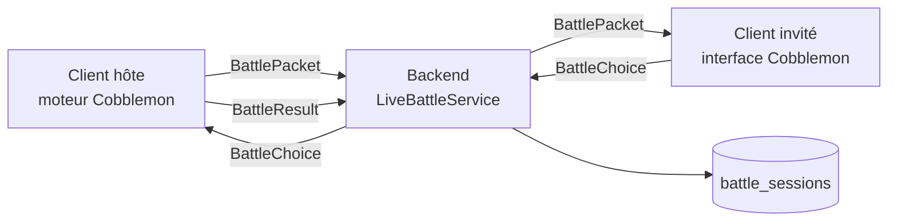

# 12. Les combats

## 12.1 Le choix d'architecture

Un combat Pokémon (dégâts, talents, objets, météo…) est très complexe. Cobblemon contient déjà un moteur complet
(Pokémon Showdown), mais il est prévu pour tourner sur un serveur Minecraft, où nous n'avons pas le droit d'installer
de code. Trois options :

1. Réécrire un moteur dans le backend : énorme, et les résultats différeraient de Cobblemon.
2. Exécuter Showdown dans le backend : le backend dépendrait de Cobblemon, ce qu'on s'interdit.
3. **Faire tourner le moteur de Cobblemon sur le jeu de l'un des deux joueurs** (« client hôte »), le backend
   servant de relais et d'arbitre minimal.

L'option 3 est retenue. Le backend ne connaît rien aux règles de combat : il fait **circuler des messages opaques**.
Le côté client (le plus complexe) est expliqué dans le parcours du dépôt Client.



## 12.2 Démarrer un combat

L'invitation suit exactement le modèle de l'échange en direct (invitation de 60 s, refus si déjà occupé…). À
l'acceptation :

```java
// battle/LiveBattleService.java (raccourci)
List<PokemonResponse> inviterTeam = pokemonService.activeTeam(inviterUuid);
List<PokemonResponse> inviteeTeam = pokemonService.activeTeam(inviteeUuid);
if (inviterTeam.isEmpty() || inviteeTeam.isEmpty()) { … "ERROR_BATTLE_EMPTY_TEAM" … }
UUID hostUuid = nextHost(inviterUuid, inviteeUuid);
…
BattleSession session = BattleSession.hosted(UUID.randomUUID(), hostUuid, guestUuid, hostTeamUuids, guestTeamUuids);
battleRepository.save(session);                                    // trace en base, statut ACTIVE
sessionRegistry.send(hostUuid, WsMessage.of("BattleSessionStarted", Map.of(
        "battle_uuid", battle.uuid, "role", "HOST", …, "own_team", hostTeam, "opponent_team", guestTeam)));
sessionRegistry.send(guestUuid, WsMessage.of("BattleSessionStarted", Map.of(
        "battle_uuid", battle.uuid, "role", "GUEST", …, "own_team", guestTeam)));   // pas l'équipe adverse
```

- L'**hôte** reçoit les deux équipes complètes : il en a besoin pour construire le combat.
- L'**invité** ne reçoit que la sienne : il découvre l'adversaire au fil du combat, comme dans le jeu.
- Les équipes sont lues **en base**, jamais fournies par les clients.

## 12.3 Choisir l'hôte : l'alternance

Celui qui héberge pourrait tricher (modifier son jeu pour gagner). Pour limiter l'abus, l'hôte **alterne** entre
deux mêmes joueurs :

```java
private UUID nextHost(UUID inviterUuid, UUID inviteeUuid) {
    List<BattleSession> history = battleRepository.findHostedBetween(inviterUuid, inviteeUuid);   // du plus récent au plus ancien
    if (history.isEmpty()) return inviterUuid;                     // premier combat : l'inviteur
    UUID previousHost = history.get(0).getHostUuid();
    return previousHost.equals(inviterUuid) ? inviteeUuid : inviterUuid;
}
```

C'est pour cela que la migration `V8` a ajouté la colonne `battle_sessions.host_uuid`.

## 12.4 Relayer sans comprendre

```java
public synchronized void relayPacket(UUID senderUuid, UUID battleUuid, Map<String, Object> data) {
    LiveBattle battle = battleOf(senderUuid, battleUuid);          // le joueur est-il bien dans CE combat ?
    if (battle == null) return;
    if (!battle.hostUuid.equals(senderUuid)) { sendError(senderUuid, "ERROR_BATTLE_NOT_HOST"); return; }
    sessionRegistry.send(battle.guestUuid, WsMessage.of("BattlePacket", data));   // tel quel
}
```

Le contenu (`payload`, un paquet Cobblemon encodé en Base64) n'est jamais lu. Le backend vérifie seulement **qui**
a le droit d'envoyer **quoi** : seul l'hôte envoie des paquets et le résultat, seul l'invité envoie des choix. Un
paquet d'équipe Cobblemon pèse plusieurs kilo-octets : c'est pourquoi la taille maximale des messages WebSocket a
été portée à 1 Mio (chapitre 10).

## 12.5 Le chrono

N'importe lequel des deux joueurs peut activer un chrono de 90 s par tour, une seule fois, sans retour possible.
Le backend se contente de mémoriser l'activation et de l'annoncer aux deux ; c'est l'hôte qui l'applique (il fait
jouer une action automatique à l'expiration).

## 12.6 Fin de combat

| Événement | Résultat |
|---|---|
| L'hôte envoie `BattleResult` (vainqueur ou `null`) | `FINISHED`, raison `FINISHED` (vainqueur vérifié : l'un des deux joueurs) |
| Un joueur envoie `BattleLeave` | `FINISHED`, raison `FORFEIT`, l'autre gagne |
| Un joueur se déconnecte | `ABORTED`, raison `PARTNER_DISCONNECTED`, pas de vainqueur |

`finish` met à jour la ligne `battle_sessions` (statut, résultat JSON, date de fin) puis envoie `BattleEnded` aux
deux. Les Pokémon stockés ne sont **jamais** modifiés par un combat : le client hôte combat avec des copies
jetables.

## 12.7 Les routes REST `/battles`

Une première version (phase 4) proposait de créer une session par `POST /battles` puis de soumettre un résultat.
Le combat en direct, qui crée lui-même sa ligne en base, les a rendues inutiles ; l'audit de sécurité du 2026-10-04
(SEC-3) a montré qu'elles contournaient ses garde-fous (combat ouvert sans accord, vainqueur déclaré par n'importe
quel participant) : elles ont été **retirées**. Seule la lecture `GET /battles/{uuid}` reste. Leçon : une ancienne
porte d'entrée qui n'est plus utilisée reste une porte d'entrée.

## À retenir

- Quand le calcul est trop complexe ou appartient à une autre plateforme, le serveur peut devenir un relais
  qui contrôle seulement les rôles.
- Les données sensibles (équipes) viennent toujours de la base ; chacun ne reçoit que ce dont il a besoin.
- L'alternance de l'hôte est un garde-fou simple contre la triche répétée.
