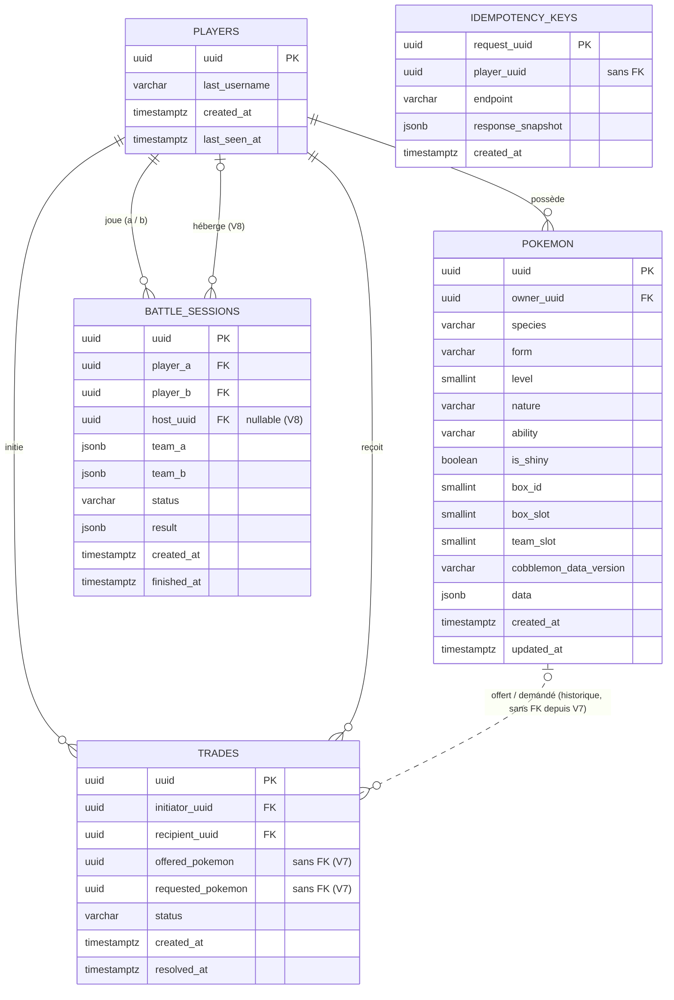

# Schéma de la base de données

> **Document vivant** : reflète le schéma **après application de toutes les migrations** Flyway
> (`src/main/resources/db/migration/`, V1 à V8). Toute nouvelle migration met à jour ce fichier, y compris le
> diagramme, dans le même changement. Vérifié contre les migrations le 2026-10-03.

## 1. Règles

1. **Flyway uniquement** : `spring.jpa.hibernate.ddl-auto=none`. Une migration appliquée n'est **jamais**
   modifiée ; toute évolution passe par une nouvelle migration `V{n}__description.sql`.
2. **Modèle hybride** : colonnes classiques pour ce qui est filtré, indexé ou contraint ; JSONB pour le reste.
3. **Identifiants Cobblemon uniquement** : jamais de statistiques de base ni de données de rendu.
4. **Pas de table pour l'état éphémère** : présence, échanges en direct et combats en cours vivent en mémoire (§8).
5. **Tests sur un vrai PostgreSQL** (Testcontainers), jamais H2 : le JSONB ne s'y comporte pas pareil.
6. Contraintes sans nom dans une ancienne migration : les retrouver dynamiquement via `pg_constraint` plutôt que
   de deviner le nom généré par PostgreSQL (méthode de `V6` et `V7`).

## 2. Diagramme



5 tables : `players`, `pokemon`, `trades`, `battle_sessions`, `idempotency_keys` (plus la table technique
`flyway_schema_history`). Pas de table `teams` (l'équipe est `pokemon.team_slot`), pas de table de présence.

## 3. `players`

Identité minimale d'un joueur. Créée à la première connexion réussie (`POST /auth/session`), mise à jour à
chaque connexion et à chaque refresh.

| Colonne | Type | Contraintes | Notes |
|---|---|---|---|
| `uuid` | UUID | PK | UUID Mojang (jamais généré par le backend) |
| `last_username` | VARCHAR(16) | NOT NULL | Pseudo au moment de la dernière connexion |
| `created_at` | TIMESTAMPTZ | NOT NULL, défaut `now()` | |
| `last_seen_at` | TIMESTAMPTZ | | Dernière connexion ou refresh |

## 4. `pokemon`

| Colonne | Type | Contraintes | Notes |
|---|---|---|---|
| `uuid` | UUID | PK | Ne change jamais, y compris lors d'un échange |
| `owner_uuid` | UUID | NOT NULL, FK → `players` `ON DELETE RESTRICT`, indexé | Change lors d'un échange |
| `species` | VARCHAR(64) | NOT NULL | Identifiant Cobblemon (`samurott`, `mimejr`…) |
| `form` | VARCHAR(64) | | `NULL` = forme de base (`hisui`, `fairy`…) |
| `level` | SMALLINT | NOT NULL, 1-100 | |
| `nature` | VARCHAR(32) | NOT NULL | `timid`, `adamant`… |
| `ability` | VARCHAR(64) | NOT NULL | `torrent`, `flash_fire`… (cohérence avec l'espèce non vérifiée en base) |
| `is_shiny` | BOOLEAN | NOT NULL, défaut `false` | |
| `box_id` | SMALLINT | 1-16 | Boîte du PC |
| `box_slot` | SMALLINT | 1-30 (`chk_pokemon_box_slot`, V6) | Case dans la boîte (6 colonnes × 5 lignes) |
| `team_slot` | SMALLINT | 1-6 | Emplacement dans l'équipe active |
| `cobblemon_data_version` | VARCHAR(32) | NOT NULL | Version de Cobblemon à la création (ex. `1.8.1`) |
| `data` | JSONB | NOT NULL, index GIN | Voir §4.2 |
| `created_at`, `updated_at` | TIMESTAMPTZ | NOT NULL, défaut `now()` | `updated_at` géré par l'application |

### 4.1 Contraintes et index

| Nom | Définition | But |
|---|---|---|
| `chk_pokemon_box_coherent` | `box_id` et `box_slot` tous deux nuls ou tous deux renseignés | Pas de case à moitié définie |
| `chk_pokemon_box_slot` | `box_slot BETWEEN 1 AND 30` | Boîtes 6×5 (V6) |
| `uq_pokemon_pc_slot` | Unique `(owner_uuid, box_id, box_slot)` si renseignés | Une case = un Pokémon |
| `uq_pokemon_team_slot` | Unique `(owner_uuid, team_slot)` si renseigné | Un emplacement d'équipe = un Pokémon |
| `idx_pokemon_owner` | `owner_uuid` | Listes par joueur |
| `idx_pokemon_data_gin` | GIN sur `data` | Requêtes futures sur le JSONB |

L'exclusivité PC / équipe (jamais les deux à la fois) est garantie par le service (`PokemonService`), pas par une
contrainte SQL. Lors d'un échange de places, l'ancienne place est libérée et flushée avant d'être réattribuée,
pour ne jamais violer les index uniques.

### 4.2 Contenu de `data`

```json
{
  "nickname": "Bichou",
  "gender": "M",
  "teraType": "grass",
  "ivs": { "hp": 31, "atk": 31, "def": 31, "spa": 31, "spd": 31, "spe": 31 },
  "evs": { "hp": 0, "atk": 144, "def": 64, "spa": 0, "spd": 136, "spe": 0 },
  "moves": ["avalanche", "aquatail", "bodyslam", "darkpulse"],
  "heldItem": "assault_vest"
}
```

| Clé | Écrite par | Règle |
|---|---|---|
| `ivs` | Import, éditeur | Chaque valeur ∈ [0, 31] (vérifié par le backend) |
| `evs` | Import, éditeur | Chaque valeur ∈ [0, 252], total ≤ 510 (vérifié par le backend) |
| `moves` | Import, éditeur | Jusqu'à 4 identifiants d'attaque, sans doublon (garanti par l'éditeur) |
| `heldItem` | Import, éditeur | Identifiant d'objet Cobblemon (chemin du registre, ex. `choice_band`) |
| `nickname` | Import, éditeur | Texte libre |
| `gender` | Import, éditeur | `"M"` ou `"F"` ; absente = aléatoire (convention Showdown) |
| `teraType` | Import, éditeur | Identifiant de type ; absente = type primaire de l'espèce |
| `friendship` | Import (ligne `Happiness:`) | Entier ; non affiché ni éditable |

**Casse des clés** : `heldItem`, `teraType` (camelCase) sont écrites telles quelles par le client ; les
stratégies de nommage (Jackson côté backend, Gson côté client) ne s'appliquent pas aux clés d'une `Map`. Ne pas
les renommer sans migration des données existantes.

`nickname`, `gender` et `teraType` sont en JSONB car ni filtrés ni indexés ; s'ils devaient l'être, une
migration additive les passerait en colonnes. `PATCH /pokemon/{uuid}` **remplace** `data` en entier.

## 5. `trades`

Historique de tous les échanges, asynchrones (REST) et en direct (WebSocket, ligne créée directement en `COMPLETED`).

| Colonne | Type | Contraintes | Notes |
|---|---|---|---|
| `uuid` | UUID | PK | |
| `initiator_uuid` | UUID | NOT NULL, FK → `players`, indexé | |
| `recipient_uuid` | UUID | NOT NULL, FK → `players`, indexé | |
| `offered_pokemon` | UUID | NOT NULL, indexé, **sans FK** (V7) | Appartenait à l'initiateur au moment de l'offre |
| `requested_pokemon` | UUID | NOT NULL, indexé, **sans FK** (V7) | Appartenait au destinataire au moment de l'offre |
| `status` | VARCHAR(16) | NOT NULL, défaut `PENDING`, ∈ {`PENDING`, `ACCEPTED`, `CANCELLED`, `COMPLETED`} | `ACCEPTED` n'est jamais produit |
| `created_at` | TIMESTAMPTZ | NOT NULL, défaut `now()` | |
| `resolved_at` | TIMESTAMPTZ | | Renseigné à l'acceptation ou l'annulation |

Contraintes et index : `chk_trade_not_self` (`initiator_uuid <> recipient_uuid`), `idx_trades_initiator`,
`idx_trades_recipient`, `idx_trades_status` (partiel, `PENDING`), `idx_trades_offered_pokemon`,
`idx_trades_requested_pokemon`.

**Pourquoi sans FK vers `pokemon`** : les FK `ON DELETE RESTRICT` d'origine (V3) empêchaient de supprimer tout
Pokémon ayant déjà été échangé. La seule protection utile (pas de suppression d'un Pokémon engagé dans un échange
`PENDING`) est faite par l'application (`ERROR_POKEMON_IN_PENDING_TRADE`).

## 6. `battle_sessions`

| Colonne | Type | Contraintes | Notes |
|---|---|---|---|
| `uuid` | UUID | PK | |
| `player_a`, `player_b` | UUID | NOT NULL, FK → `players`, indexés | Combat en direct : `player_a` = hôte. Anciennes lignes créées par `POST /battles` (route retirée le 2026-10-04) : `player_a` = appelant. |
| `host_uuid` | UUID | FK → `players`, indexé (V8) | Client qui a exécuté le moteur ; `NULL` pour les anciennes lignes de `POST /battles` (route retirée). Sert à l'alternance de l'hôte. |
| `team_a`, `team_b` | JSONB | NOT NULL | Instantané des UUID de Pokémon engagés, sans FK (historique) |
| `status` | VARCHAR(16) | NOT NULL, défaut `PENDING`, ∈ {`PENDING`, `ACTIVE`, `FINISHED`, `ABORTED`} | Les sessions sont créées `ACTIVE` |
| `result` | JSONB | | REST : `{winner_uuid, log}`. Direct : `{winner_uuid, reason}` (`FINISHED`, `FORFEIT`, `PARTNER_DISCONNECTED`) |
| `created_at` | TIMESTAMPTZ | NOT NULL, défaut `now()` | |
| `finished_at` | TIMESTAMPTZ | | |

Contrainte : `chk_battle_not_self` (`player_a <> player_b`). Index : `idx_battle_player_a`, `idx_battle_player_b`,
`idx_battle_host`.

## 7. `idempotency_keys`

Journal technique anti-doublon des `POST` sensibles.

| Colonne | Type | Contraintes | Notes |
|---|---|---|---|
| `request_uuid` | UUID | PK | Généré par le client |
| `player_uuid` | UUID | NOT NULL, **sans FK** | Volontaire : un journal technique ne doit pas dépendre du cycle de vie des joueurs |
| `endpoint` | VARCHAR(64) | NOT NULL | `POST /pokemon`, `POST /trades` (`POST /battles` dans d'anciennes lignes). Comparé, avec `player_uuid`, à chaque réutilisation (SEC-7) |
| `response_snapshot` | JSONB | | Réponse d'origine, rejouée telle quelle |
| `created_at` | TIMESTAMPTZ | NOT NULL, défaut `now()` | Aucune purge en V1 |

Index : `idx_idempotency_player_endpoint` (`player_uuid`, `endpoint`).

## 8. État hors base

| Structure | Service | Contenu |
|---|---|---|
| `PlayerPresence` | `PresenceService` | `player_uuid`, `server_fingerprint`, `dimension`, `position`, `last_heartbeat_at`, `active_ghost_pokemon_uuid` (un seul Ghost sorti à la fois) |
| Sessions d'échange en direct | `LiveTradeService` | Participants, offres, drapeaux « prêt », invitations |
| Combats en cours | `LiveBattleService` | Hôte, invité, chrono, invitations |

Tout est perdu au redémarrage du backend (comportement voulu) et n'est pas partagé entre instances.

## 9. Historique des migrations

| Version | Fichier | Date | Contenu |
|---|---|---|---|
| V1 | `V1__init_players.sql` | 2026-09-25 | Table `players` |
| V2 | `V2__init_pokemon.sql` | 2026-09-25 | Table `pokemon`, index et contraintes (cases 1-36) |
| V3 | `V3__init_trades.sql` | 2026-09-25 | Table `trades` (avec FK vers `pokemon`) |
| V4 | `V4__init_battle_sessions.sql` | 2026-09-25 | Table `battle_sessions` |
| V5 | `V5__init_idempotency_keys.sql` | 2026-09-25 | Table `idempotency_keys` |
| V6 | `V6__resize_pokemon_box.sql` | 2026-09-27 | Boîtes 6×5 : contrainte `box_slot` 1-30 (`chk_pokemon_box_slot`), ancienne contrainte retrouvée via `pg_constraint` |
| V7 | `V7__trades_pokemon_history_without_fk.sql` | 2026-10-02 | Retrait des FK `trades → pokemon`, index sur `offered_pokemon` / `requested_pokemon` |
| V8 | `V8__battle_sessions_host.sql` | 2026-10-03 | Colonne `battle_sessions.host_uuid` et son index |

## 10. Décisions de schéma

| Sujet | Décision |
|---|---|
| Contraintes `CHECK` sur les statuts, index uniques PC/équipe, `chk_*_not_self` | Ajoutés au SQL illustratif du CAD : empêchent des états incohérents à faible coût |
| `box_id` / `box_slot` nullables | Un Pokémon de l'équipe n'a pas de case PC ; à la création sans emplacement, le service attribue la première case libre |
| Pas de FK sur `idempotency_keys.player_uuid` | Journal technique indépendant des joueurs |
| Instantanés JSONB sans FK (`team_a`, `team_b`, colonnes Pokémon de `trades`) | Historique qui doit survivre à la modification ou suppression des Pokémon |
| Une seule équipe active | Décision D-03 ([`architecture/decisions.md`](../architecture/decisions.md)) |
